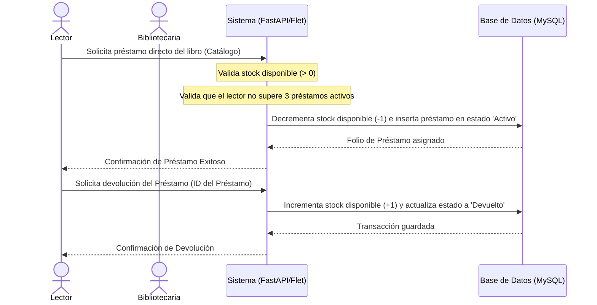

# Manual de Usuario: Funcionamiento del Sistema de Biblioteca

Esta es una guía rápida y sencilla para comprender cómo interactuar con el sistema de gestión de biblioteca y cómo funciona en sus diferentes interfaces.

---

## 1. Perfiles de Acceso (Roles de Usuario)

El sistema cuenta con un sistema de separación de roles que divide los permisos y las vistas según el perfil seleccionado en la pantalla de login:

### A. Perfil: Bibliotecario(a) (Administrador)
Es la persona encargada de la gestión del inventario y el control de transacciones de la biblioteca. Al ingresar como administrador, tendrás acceso a:
1.  **Dashboard**: Un panel resumen que muestra el total de libros, miembros, préstamos activos y un historial de las transacciones más recientes.
2.  **Catálogo Completo**: Permite buscar y ver todos los libros, además de añadir nuevos títulos mediante el botón **"Agregar Libro"**.
3.  **Gestión de Miembros**: Permite registrar y buscar a los miembros afiliados. Cada miembro tiene un **ID único** y un **correo electrónico**.
4.  **Préstamos**: Panel administrativo para:
    *   Ver préstamos activos e históricos de transacciones del sistema.
    *   Realizar reclamos al miembro o aplicar sanciones administrativas.

### B. Perfil: Lector / Miembro (Usuario)
Es el usuario que asiste a la biblioteca a solicitar ejemplares. Al ingresar con tu **correo electrónico** registrado, el sistema te identificará y restringirá tu acceso para proteger los datos administrativos:
1.  **Catálogo de Libros**: Permite buscar libros disponibles. 
    *   Si hay stock físico disponible, verás un botón directo de **"Solicitar"** para pedir el libro a tu nombre por un periodo estándar de 7 días.
    *   Si no hay stock, el sistema mostrará "Sin Stock".
2.  **Mis Préstamos**: Panel personal donde el lector puede ver exclusivamente su historial de transacciones, con las fechas de préstamo, fechas de vencimiento y el estado actual (si está activo o ya fue devuelto).

---

## 2. Flujo del Proceso: Préstamo y Devolución

El ciclo de vida de un libro en el sistema sigue tres pasos sencillos:



---

## 3. ¿Cómo Ejecutar el Sistema?

### A. Opción 1: Aplicación de Escritorio (Flet)
1.  Asegúrate de que tu base de datos MySQL local esté encendida.
2.  Ejecuta el archivo gráfico:
    ```bash
    python gui.py
    ```
3.  Se abrirá una ventana de escritorio donde podrás elegir tu rol e ingresar.

### B. Opción 2: Aplicación Web (FastAPI + HTML)
1.  Inicia el servidor web ejecutando:
    ```bash
    python app.py
    ```
2.  Abre tu navegador de preferencia y dirígete a:
    `http://127.0.0.1:8000`
3.  Interactúa con la interfaz web SPA integrada.
