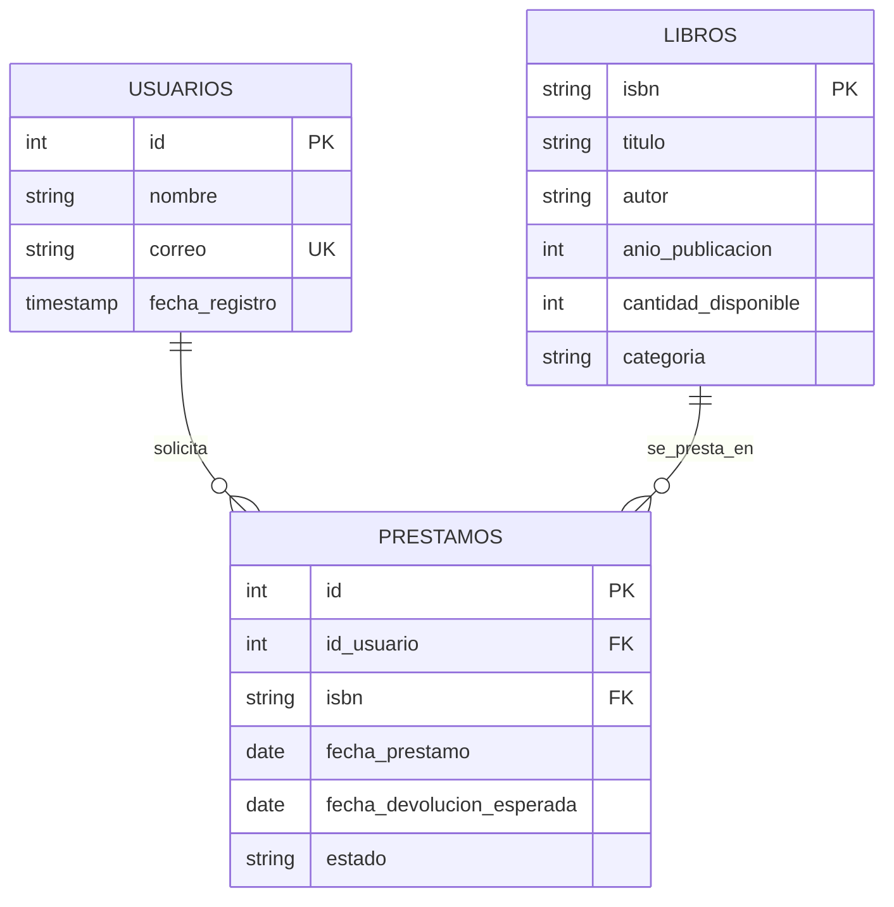

# Documentación: Modelo Entidad-Relación y Organización de Carpetas

Este documento proporciona una especificación formal del **Modelo Entidad-Relación (E-R)** de la base de datos MySQL y describe detalladamente la **Organización de Carpetas** y archivos que componen el proyecto del Sistema de Gestión de Biblioteca.

---

## 1. Modelo Entidad-Relación (E-R)

El diseño relacional se compone de tres entidades principales: **Usuarios**, **Libros** y **Préstamos**.

### A. Diccionario de Entidades y Atributos

#### 1. Entidad: `usuarios` (Representa a los miembros de la biblioteca)
*   **`id`** (`INT`, Primary Key, Autoincremental): Identificador único del miembro.
*   **`nombre`** (`VARCHAR(100)`, Obligatorio): Nombre completo del usuario.
*   **`correo`** (`VARCHAR(100)`, Obligatorio, Único): Dirección de correo electrónico.
*   **`fecha_registro`** (`TIMESTAMP`, Default: `CURRENT_TIMESTAMP`): Fecha y hora de alta del miembro.
*   *Restricción lógica*: El correo debe tener una estructura básica válida conteniendo `@` y `.` (`CONSTRAINT chk_correo_valido CHECK (correo LIKE '%@%.%')`).

#### 2. Entidad: `libros` (Representa los títulos catalogados en inventario)
*   **`isbn`** (`VARCHAR(20)`, Primary Key): Código estándar internacional del libro.
*   **`titulo`** (`VARCHAR(255)`, Obligatorio): Título del libro.
*   **`autor`** (`VARCHAR(150)`, Obligatorio): Nombre del autor del libro.
*   **`anio_publicacion`** (`INT`, Obligatorio): Año en que fue publicado.
*   **`cantidad_disponible`** (`INT`, Obligatorio, Default: `0`): Cantidad física de ejemplares disponibles en sala.
*   **`categoria`** (`VARCHAR(100)`, Default: `'Sin Categoría'`): Género o categoría literaria.
*   *Restricción lógica 1*: El stock físico no puede ser negativo (`CONSTRAINT chk_cantidad_no_negativa CHECK (cantidad_disponible >= 0)`).
*   *Restricción lógica 2*: El año de publicación debe ser estrictamente positivo (`CONSTRAINT chk_anio_valido CHECK (anio_publicacion > 0)`).

#### 3. Entidad: `prestamos` (Entidad asociativa que registra la transacción de préstamo)
*   **`id`** (`INT`, Primary Key, Autoincremental): Número de folio o ticket de préstamo.
*   **`id_usuario`** (`INT`, Foreign Key, Obligatorio): Enlace al usuario que solicita el libro.
*   **`isbn`** (`VARCHAR(20)`, Foreign Key, Obligatorio): Enlace al libro prestado.
*   **`fecha_prestamo`** (`DATE`, Obligatorio): Fecha en que se retira el libro.
*   **`fecha_devolucion_esperada`** (`DATE`, Obligatorio): Fecha límite programada para la restitución del libro.
*   **`estado`** (`VARCHAR(20)`, Obligatorio, Default: `'Activo'`): Estado actual de la transacción (`'Activo'` o `'Devuelto'`).
*   *Restricción lógica 1*: El estado del préstamo solo puede adoptar los valores `'Activo'` o `'Devuelto'` (`CONSTRAINT chk_estado_prestamo CHECK (estado IN ('Activo', 'Devuelto'))`).
*   *Restricción lógica 2*: La fecha de vencimiento no puede ser anterior a la fecha de préstamo (`CONSTRAINT chk_fechas CHECK (fecha_devolucion_esperada >= fecha_prestamo)`).

---

### B. Relaciones y Cardinalidades



*   **Relación Usuarios ↔ Préstamos (1:N)**:
    *   Un **Usuario** puede registrar cero, uno o muchos **Préstamos** a lo largo del tiempo (cardinalidad `1 a N`).
    *   Un **Préstamo** pertenece obligatoriamente a un único **Usuario** (cardinalidad `1 a 1`).
    *   **Políticas referenciales**: `ON DELETE RESTRICT` (Impide eliminar un usuario si tiene préstamos) y `ON UPDATE CASCADE` (Actualiza el ID en préstamos si el ID de usuario cambia).
*   **Relación Libros ↔ Préstamos (1:N)**:
    *   Un **Libro** puede ser objeto de cero, uno o muchos **Préstamos** (cardinalidad `1 a N`).
    *   Un **Préstamo** asocia obligatoriamente a un único **Libro** por cada registro (cardinalidad `1 a 1`).
    *   **Políticas referenciales**: `ON DELETE RESTRICT` (Impide eliminar un libro si hay préstamos registrados de él) y `ON UPDATE CASCADE`.

---

## 2. Organización y Estructura de Carpetas

El proyecto sigue una arquitectura organizada para aislar la capa de interfaz de usuario de la persistencia física de los datos y las reglas del negocio.

### A. Árbol de Directorios del Workspace

```bash
Raíz del Proyecto/
│
├── database/               # Persistencia de Datos y Conexión SQL
│   ├── connection.py       # Administrador de contextos DatabaseConnection e inicializador de tablas
│   └── schema.sql          # Sentencias DDL para estructura de tablas, constraints e índices
│
├── models/                 # Capa de Modelos (Clases de Dominio)
│   ├── libro.py            # Clase Libro e inicializadores mapping
│   ├── usuario.py          # Clase Usuario e inicializadores mapping
│   └── prestamo.py         # Clase Prestamo e inicializadores mapping
│
├── services/               # Capa de Lógica de Negocio (Servicios)
│   ├── exceptions.py       # Excepciones de negocio personalizadas
│   ├── libro_service.py    # Reglas y validaciones para altas y búsquedas de libros
│   ├── usuario_service.py  # Reglas para registros y listados de miembros
│   └── prestamo_service.py # Control transaccional ACID de préstamos y devoluciones
│
├── frontend/               # Interfaz Web de Usuario (FastAPI frontend)
│   ├── index.html          # Interfaz estructurada SPA
│   ├── style.css           # Estilos modernos CSS, variables de colores, temas y animaciones
│   └── app.js              # Lógica de interfaz asíncrona (Fetch API) y router cliente
│
├── tests/                  # Capa de Verificación y Calidad
│   └── test_library.py     # Pruebas de funcionamiento lógico usando MagicMocks
│
├── app.py                  # API REST (FastAPI) y servidor de archivos estáticos
├── gui.py                  # Aplicación de escritorio nativa (Flet UI)
├── main.py                 # Aplicación interactiva de consola (CLI)
├── config.py               # Cargador de variables de entorno (.env)
└── requirements.txt        # Declaración de dependencias del proyecto de Python
```

---

### B. Justificación Estructural de las Capas

1.  **Independencia de UI**:
    La lógica que verifica si hay stock de un libro ([prestamo_service.py](file:///c:/Users/Andy_PC/Documents/UNE/Base%20de%20datos%20IV/Proyecto-BD4-main/services/prestamo_service.py)) no sabe ni le importa si el usuario hace clic en un navegador web ([app.js](file:///c:/Users/Andy_PC/Documents/UNE/Base%20de%20datos%20IV/Proyecto-BD4-main/frontend/app.js)), presiona un botón de Flet ([gui.py](file:///c:/Users/Andy_PC/Documents/UNE/Base%20de%20datos%20IV/Proyecto-BD4-main/gui.py)) o escribe un número en la consola ([main.py](file:///c:/Users/Andy_PC/Documents/UNE/Base%20de%20datos%20IV/Proyecto-BD4-main/main.py)). Las tres interfaces llaman a los mismos métodos del servicio.
2.  **Encapsulamiento de Errores (exceptions.py)**:
    En lugar de retornar códigos numéricos oscuros de error o cadenas de texto, la capa de servicios lanza excepciones semánticas como `SinStockError`. La capa de presentación las atrapa y las muestra de forma amigable (un Toast rojo en la web, un SnackBar en Flet, o un mensaje `[ERROR]` en la terminal).
3.  **Seguridad y Contextualización de la BD (connection.py)**:
    La clase `DatabaseConnection` encapsula el control de conexiones y transacciones. Esto previene fugas de recursos (conexiones abiertas) e inconsistencias al obligar a realizar un `rollback()` si un servicio lanza una excepción a mitad del proceso.
